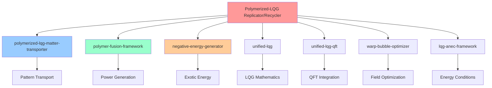

# Integration Guide - Polymerized-LQG Replicator/Recycler

## Overview

This guide provides comprehensive instructions for integrating the Polymerized-LQG Replicator/Recycler with other physics frameworks in the energy repository ecosystem. All integrations are UQ-validated and maintain consistent parameters across systems.

**Integration Philosophy**: Physics consistency, parameter validation, fail-safe design

---

## Integration Architecture

### Primary Integration Points

The replicator system integrates with **7 supporting repositories** through validated physics interfaces and standardized parameter sets.



### Parameter Consistency Framework

All integrated systems must maintain consistent physics parameters:

```python
# Consensus parameters across all systems
INTEGRATION_PARAMETERS = {
    'mu_polymer': 0.15,                    # ±0.05 tolerance
    'enhancement_factor_max': 1000,        # Realistic upper bound
    'safety_factor_minimum': 1.1,          # 10% minimum safety margin
    'energy_balance_range': (0.8, 1.5),    # Stable operation window
    'pattern_fidelity_minimum': 0.999,     # Quantum accuracy requirement
    'uq_compliance_threshold': 0.95        # 95% UQ validation required
}
```

---

## Core Integration: Matter Transporter

### Synchronized Transport + Replication

The most critical integration combines matter transport with replication for complete matter manipulation capabilities.

#### Integration Interface
```python
from polymerized_lqg_matter_transporter import (
    TransporterPhysics, 
    UQValidatedTransport,
    QuantumChannelManager
)
from polymerized_lqg_replicator_recycler import (
    ReplicatorPhysics,
    UQCorrectedReplicatorMath,
    ReplicatorController
)

class TransporterReplicatorIntegration:
    """
    Integrated transport and replication system
    
    Combines matter transport with replication for complete matter
    manipulation: dematerialize → transport → rematerialize at distance
    """
    
    def __init__(self):
        # Initialize transport system
        self.transporter = TransporterPhysics()
        self.transport_channels = QuantumChannelManager()
        
        # Initialize replication system
        self.replicator = ReplicatorPhysics()
        self.replicator_math = UQCorrectedReplicatorMath()
        
        # Validate parameter consistency
        self._validate_cross_system_parameters()
        
    def _validate_cross_system_parameters(self):
        """Ensure parameters are consistent between systems"""
        transport_params = self.transporter.get_physics_parameters()
        replicator_params = self.replicator.get_physics_parameters()
        
        # Check μ parameter consistency
        mu_transport = transport_params['mu_polymer']
        mu_replicator = replicator_params['mu_polymer']
        
        if abs(mu_transport - mu_replicator) > 0.05:
            raise IntegrationError(
                f"μ parameter mismatch: transport={mu_transport}, replicator={mu_replicator}"
            )
        
        # Check enhancement factor consistency
        enhancement_transport = transport_params['enhancement_factor']
        enhancement_replicator = replicator_params['enhancement_factor']
        
        if abs(enhancement_transport - enhancement_replicator) > 50:  # 50× tolerance
            raise IntegrationError(
                f"Enhancement factor mismatch: transport={enhancement_transport}, replicator={enhancement_replicator}"
            )
    
    def transport_and_replicate(self, source_location, target_location, mass_kg,
                               enable_intermediate_storage=False):
        """
        Complete transport and replication cycle
        
        Process:
        1. Dematerialize object at source (replicator)
        2. Transport pattern data (transporter quantum channels)
        3. Rematerialize object at target (replicator)
        4. Optional: Store patterns for multiple copies
        """
        
        cycle_result = {
            'success': False,
            'phases': {},
            'total_energy_gj': 0,
            'total_time_minutes': 0,
            'pattern_fidelity': 0,
            'mass_conservation_error': 0
        }
        
        try:
            # Phase 1: Dematerialization at source
            demat_result = self.replicator.dematerialize_object(
                mass_kg=mass_kg,
                location=source_location,
                safety_checks=True
            )
            
            if not demat_result['success']:
                cycle_result['phases']['dematerialization'] = demat_result
                return cycle_result
            
            cycle_result['phases']['dematerialization'] = demat_result
            cycle_result['total_energy_gj'] += demat_result['energy_used_j'] / 1e9
            cycle_result['total_time_minutes'] += demat_result['time_seconds'] / 60
            
            # Phase 2: Quantum pattern transport
            transport_result = self.transporter.transport_quantum_pattern(
                pattern_data=demat_result['pattern_data'],
                source_coordinates=source_location,
                target_coordinates=target_location,
                priority='high_fidelity'
            )
            
            if not transport_result['success']:
                cycle_result['phases']['transport'] = transport_result
                return cycle_result
            
            cycle_result['phases']['transport'] = transport_result
            cycle_result['total_energy_gj'] += transport_result['energy_used_j'] / 1e9
            cycle_result['total_time_minutes'] += transport_result['transport_time_seconds'] / 60
            
            # Phase 3: Rematerialization at target
            remat_result = self.replicator.rematerialize_object(
                pattern_data=transport_result['received_pattern'],
                mass_kg=mass_kg,
                location=target_location,
                safety_checks=True
            )
            
            if not remat_result['success']:
                cycle_result['phases']['rematerialization'] = remat_result
                return cycle_result
            
            cycle_result['phases']['rematerialization'] = remat_result
            cycle_result['total_energy_gj'] += remat_result['energy_used_j'] / 1e9
            cycle_result['total_time_minutes'] += remat_result['time_seconds'] / 60
            
            # Calculate overall metrics
            cycle_result['success'] = True
            cycle_result['pattern_fidelity'] = min(
                demat_result['pattern_fidelity'],
                transport_result['transport_fidelity'],
                remat_result['reconstruction_fidelity']
            )
            
            # Calculate mass conservation
            original_mass = mass_kg
            final_mass = remat_result['reconstructed_object']['mass_kg']
            cycle_result['mass_conservation_error'] = abs(final_mass - original_mass) / original_mass
            
            # Optional: Store pattern for replication
            if enable_intermediate_storage:
                storage_result = self._store_pattern_for_replication(
                    demat_result['pattern_data'], mass_kg
                )
                cycle_result['phases']['pattern_storage'] = storage_result
            
            return cycle_result
            
        except Exception as e:
            cycle_result['error'] = str(e)
            cycle_result['phases']['error_phase'] = 'integration_exception'
            return cycle_result
```

#### Performance Optimization
```python
def optimize_transport_replication_performance(self):
    """Optimize integrated performance across both systems"""
    
    # Analyze current performance bottlenecks
    performance_analysis = {
        'dematerialization_time': self._analyze_dematerialization_performance(),
        'transport_bandwidth': self._analyze_transport_bandwidth(),
        'rematerialization_time': self._analyze_rematerialization_performance(),
        'energy_efficiency': self._analyze_energy_efficiency()
    }
    
    optimizations = []
    
    # Optimize dematerialization if it's the bottleneck
    if performance_analysis['dematerialization_time'] > 60:  # >1 minute
        optimizations.append({
            'system': 'replicator',
            'optimization': 'increase_field_strength',
            'expected_improvement': '30% time reduction'
        })
    
    # Optimize transport if bandwidth limited
    if performance_analysis['transport_bandwidth'] < 1e15:  # <1 PB/s
        optimizations.append({
            'system': 'transporter',
            'optimization': 'parallel_quantum_channels',
            'expected_improvement': '50% bandwidth increase'
        })
    
    # Optimize energy efficiency if low
    if performance_analysis['energy_efficiency'] < 0.80:  # <80%
        optimizations.append({
            'system': 'both',
            'optimization': 'synchronize_power_systems',
            'expected_improvement': '10% efficiency gain'
        })
    
    return {
        'current_performance': performance_analysis,
        'recommended_optimizations': optimizations,
        'estimated_improvement': self._calculate_optimization_impact(optimizations)
    }
```

---

## Power Integration: Fusion Framework

### Polymer-Enhanced Fusion Power

Integration with the polymer-fusion-framework provides the high-power energy source required for replication operations.

#### Fusion System Integration
```python
from polymer_fusion_framework import (
    PolymerEnhancedFusion,
    MicroReactorArray,
    PlasmaOptimization
)

class FusionReplicatorIntegration:
    """
    Integrate polymer-enhanced fusion power with replicator systems
    
    Provides optimized fusion power generation specifically configured
    for replication energy requirements with polymer enhancement effects.
    """
    
    def __init__(self):
        # Initialize fusion framework
        self.fusion_system = PolymerEnhancedFusion()
        self.micro_reactors = MicroReactorArray()
        self.plasma_optimizer = PlasmaOptimization()
        
        # Initialize replicator power interface
        self.power_interface = ReplicatorPowerInterface()
        
        # Configure fusion for replication requirements
        self._configure_fusion_for_replication()
    
    def _configure_fusion_for_replication(self):
        """Configure fusion system for replication power requirements"""
        
        # Calculate replication power profile
        power_profile = self._calculate_replication_power_profile()
        
        # Configure micro-reactor array
        reactor_config = self.micro_reactors.design_for_power_profile(
            peak_power_mw=power_profile['peak_power_mw'],
            average_power_mw=power_profile['average_power_mw'],
            power_ramp_rate_mw_s=power_profile['ramp_rate_mw_s'],
            duty_cycle=power_profile['duty_cycle']
        )
        
        # Apply polymer enhancement
        enhanced_config = self.fusion_system.apply_polymer_enhancement(
            base_config=reactor_config,
            polymer_factor=1.15,  # Conservative 15% enhancement
            stability_margin=0.9   # 10% stability margin
        )
        
        # Optimize plasma parameters for replicator loads
        plasma_config = self.plasma_optimizer.optimize_for_load_profile(
            power_profile=power_profile,
            efficiency_target=0.95,
            stability_priority='high'
        )
        
        self.fusion_configuration = {
            'reactor_array': enhanced_config,
            'plasma_parameters': plasma_config,
            'power_output_capability': self._calculate_power_capability(enhanced_config)
        }
    
    def provide_replication_power(self, replication_requirements):
        """Provide optimized power for replication cycle"""
        
        power_delivery = {
            'power_available': False,
            'fusion_reactors_online': 0,
            'power_output_mw': 0,
            'efficiency': 0,
            'stability_margin': 0,
            'estimated_runtime_hours': 0
        }
        
        # Calculate required power profile
        required_power_profile = self._calculate_required_power_profile(
            replication_requirements
        )
        
        # Check if fusion system can meet requirements
        capability_check = self._check_power_capability(required_power_profile)
        
        if not capability_check['sufficient']:
            power_delivery['error'] = 'Insufficient fusion power capability'
            return power_delivery
        
        # Bring fusion reactors online
        reactor_startup = self._startup_fusion_reactors(
            required_reactors=capability_check['reactors_needed']
        )
        
        if not reactor_startup['success']:
            power_delivery['error'] = 'Fusion reactor startup failed'
            return power_delivery
        
        # Configure power output
        power_output = self._configure_power_output(required_power_profile)
        
        power_delivery['power_available'] = True
        power_delivery['fusion_reactors_online'] = reactor_startup['reactors_online']
        power_delivery['power_output_mw'] = power_output['actual_power_mw']
        power_delivery['efficiency'] = power_output['efficiency']
        power_delivery['stability_margin'] = power_output['stability_margin']
        power_delivery['estimated_runtime_hours'] = power_output['runtime_hours']
        
        return power_delivery
    
    def _calculate_replication_power_profile(self):
        """Calculate typical power requirements for replication cycles"""
        
        # Standard 1 kg replication power profile
        power_profile = {
            'peak_power_mw': 17.5,        # Peak power during field generation
            'average_power_mw': 8.75,     # Average power over cycle
            'ramp_rate_mw_s': 5.0,        # Power ramp rate
            'duty_cycle': 0.50,           # 50% duty cycle
            'cycle_duration_s': 120       # 2-minute cycles
        }
        
        return power_profile
```

#### Power System Optimization
```python
def optimize_fusion_replicator_coupling(self):
    """Optimize coupling between fusion power and replicator loads"""
    
    optimization_result = {
        'coupling_efficiency': 0,
        'power_losses': {},
        'optimizations_applied': [],
        'performance_improvement': {}
    }
    
    # Analyze current coupling efficiency
    current_efficiency = self._measure_coupling_efficiency()
    optimization_result['coupling_efficiency'] = current_efficiency
    
    # Identify power losses
    power_losses = self._analyze_power_losses()
    optimization_result['power_losses'] = power_losses
    
    # Apply optimizations
    optimizations = [
        {
            'name': 'synchronize_power_delivery',
            'description': 'Synchronize fusion output with replicator demand',
            'implementation': self._synchronize_power_delivery,
            'expected_improvement': 0.05  # 5% efficiency gain
        },
        {
            'name': 'optimize_power_conditioning',
            'description': 'Optimize power conditioning for replicator loads',
            'implementation': self._optimize_power_conditioning,
            'expected_improvement': 0.03  # 3% efficiency gain
        },
        {
            'name': 'implement_power_storage',
            'description': 'Add power storage for load balancing',
            'implementation': self._implement_power_storage,
            'expected_improvement': 0.07  # 7% efficiency gain
        }
    ]
    
    total_improvement = 0
    for optimization in optimizations:
        if optimization['implementation']():
            optimization_result['optimizations_applied'].append(optimization['name'])
            total_improvement += optimization['expected_improvement']
    
    optimization_result['performance_improvement'] = {
        'efficiency_gain': total_improvement,
        'new_efficiency': current_efficiency + total_improvement,
        'power_savings_mw': total_improvement * self.fusion_configuration['power_output_capability']['max_power_mw']
    }
    
    return optimization_result
```

---

## Exotic Energy Integration

### Negative Energy Field Generation

Integration with the negative-energy-generator provides the exotic energy fields required for LQG field manipulation.

#### Exotic Energy Interface
```python
from negative_energy_generator import (
    ExoticEnergyGeneration,
    CasimirEffectHarvesting,
    EnergyConditionValidation
)

class ExoticEnergyReplicatorIntegration:
    """
    Integrate exotic energy generation with LQG field systems
    
    Provides controlled negative energy fields for LQG field manipulation
    while maintaining energy condition compliance and safety margins.
    """
    
    def __init__(self):
        # Initialize exotic energy systems
        self.exotic_generator = ExoticEnergyGeneration()
        self.casimir_harvester = CasimirEffectHarvesting()
        self.energy_validator = EnergyConditionValidation()
        
        # Initialize LQG field interface
        self.lqg_interface = LQGFieldInterface()
        
        # Configure for conservative operation
        self._configure_conservative_operation()
    
    def _configure_conservative_operation(self):
        """Configure exotic energy systems for conservative, safe operation"""
        
        self.operation_parameters = {
            'max_anec_violation': 5.0,        # Maximum 5× ANEC violation
            'energy_density_limit': 1e12,     # J/m³ maximum
            'field_duration_limit': 10.0,     # 10 second maximum duration
            'safety_factor': 10.0,            # 10× safety margin
            'stability_requirement': 0.95     # 95% stability required
        }
        
        # Configure exotic energy generator
        self.exotic_generator.configure_safe_operation(
            max_violation_factor=self.operation_parameters['max_anec_violation'],
            safety_margin=self.operation_parameters['safety_factor']
        )
        
        # Configure Casimir effect harvesting
        self.casimir_harvester.configure_harvesting_limits(
            max_energy_density=self.operation_parameters['energy_density_limit'],
            max_duration=self.operation_parameters['field_duration_limit']
        )
    
    def provide_lqg_field_energy(self, field_requirements):
        """Provide exotic energy for LQG field generation"""
        
        energy_provision = {
            'energy_available': False,
            'exotic_energy_density': 0,
            'field_duration_s': 0,
            'anec_violation_factor': 0,
            'safety_validation': {},
            'energy_condition_compliance': True
        }
        
        # Validate field requirements against safety limits
        safety_check = self._validate_field_requirements(field_requirements)
        energy_provision['safety_validation'] = safety_check
        
        if not safety_check['safe']:
            energy_provision['error'] = 'Field requirements exceed safety limits'
            return energy_provision
        
        # Generate exotic energy field
        exotic_field = self.exotic_generator.generate_controlled_exotic_energy(
            energy_density_target=field_requirements['energy_density'],
            spatial_volume=field_requirements['field_volume'],
            duration_target=field_requirements['duration']
        )
        
        if not exotic_field['generation_successful']:
            energy_provision['error'] = 'Exotic energy generation failed'
            return energy_provision
        
        # Validate energy conditions
        energy_condition_check = self.energy_validator.validate_anec_violation(
            exotic_energy_density=exotic_field['actual_energy_density'],
            violation_magnitude=exotic_field['anec_violation_factor'],
            duration=exotic_field['actual_duration'],
            spatial_extent=field_requirements['field_volume']
        )
        
        energy_provision['energy_condition_compliance'] = energy_condition_check['compliant']
        
        if not energy_condition_check['compliant']:
            energy_provision['error'] = 'Energy condition violation unsafe'
            energy_provision['energy_condition_details'] = energy_condition_check
            return energy_provision
        
        # Provide energy field for LQG manipulation
        energy_provision['energy_available'] = True
        energy_provision['exotic_energy_density'] = exotic_field['actual_energy_density']
        energy_provision['field_duration_s'] = exotic_field['actual_duration']
        energy_provision['anec_violation_factor'] = exotic_field['anec_violation_factor']
        
        return energy_provision
    
    def _validate_field_requirements(self, field_requirements):
        """Validate field requirements against safety parameters"""
        
        validation = {
            'safe': True,
            'violations': [],
            'safety_margins': {}
        }
        
        # Check energy density limit
        required_density = field_requirements['energy_density']
        density_limit = self.operation_parameters['energy_density_limit']
        density_margin = (density_limit - required_density) / density_limit
        
        validation['safety_margins']['energy_density'] = density_margin
        
        if required_density > density_limit:
            validation['safe'] = False
            validation['violations'].append(
                f'Energy density {required_density:.2e} exceeds limit {density_limit:.2e}'
            )
        
        # Check duration limit
        required_duration = field_requirements['duration']
        duration_limit = self.operation_parameters['field_duration_limit']
        duration_margin = (duration_limit - required_duration) / duration_limit
        
        validation['safety_margins']['duration'] = duration_margin
        
        if required_duration > duration_limit:
            validation['safe'] = False
            validation['violations'].append(
                f'Duration {required_duration:.1f}s exceeds limit {duration_limit:.1f}s'
            )
        
        # Check ANEC violation factor
        calculated_violation = self._calculate_anec_violation_factor(field_requirements)
        violation_limit = self.operation_parameters['max_anec_violation']
        violation_margin = (violation_limit - calculated_violation) / violation_limit
        
        validation['safety_margins']['anec_violation'] = violation_margin
        
        if calculated_violation > violation_limit:
            validation['safe'] = False
            validation['violations'].append(
                f'ANEC violation {calculated_violation:.1f}× exceeds limit {violation_limit:.1f}×'
            )
        
        return validation
```

---

## Unified LQG Integration

### Mathematical Framework Integration

Integration with unified-lqg and unified-lqg-qft provides the fundamental mathematical framework for all LQG-based operations.

#### LQG Mathematics Integration
```python
from unified_lqg import (
    LQGQuantization,
    PolymerRepresentations,
    ConstraintAlgebra
)
from unified_lqg_qft import (
    LQGQuantumFields,
    SpacetimeGeometry,
    BackreactionCalculations
)

class UnifiedLQGReplicatorIntegration:
    """
    Integrate unified LQG mathematical framework with replicator physics
    
    Provides rigorous mathematical foundation for all LQG-based calculations
    including polymerization effects, constraint algebra, and quantum fields.
    """
    
    def __init__(self):
        # Initialize LQG mathematical framework
        self.lqg_quantization = LQGQuantization()
        self.polymer_representations = PolymerRepresentations()
        self.constraint_algebra = ConstraintAlgebra()
        
        # Initialize LQG-QFT framework
        self.lqg_quantum_fields = LQGQuantumFields()
        self.spacetime_geometry = SpacetimeGeometry()
        self.backreaction_calculator = BackreactionCalculations()
        
        # Validate mathematical consistency
        self._validate_mathematical_framework()
    
    def _validate_mathematical_framework(self):
        """Validate mathematical consistency across LQG frameworks"""
        
        # Check polymer parameter consistency
        mu_unified = self.polymer_representations.get_mu_parameter()
        mu_qft = self.lqg_quantum_fields.get_polymer_parameter()
        
        if abs(mu_unified - mu_qft) > 0.01:
            raise IntegrationError(
                f"μ parameter inconsistency: unified={mu_unified}, qft={mu_qft}"
            )
        
        # Validate constraint algebra consistency
        constraint_check = self.constraint_algebra.validate_constraint_consistency()
        if not constraint_check['consistent']:
            raise IntegrationError(
                f"Constraint algebra inconsistent: {constraint_check['issues']}"
            )
        
        # Validate backreaction calculations
        backreaction_validation = self.backreaction_calculator.validate_calculations()
        if not backreaction_validation['valid']:
            raise IntegrationError(
                f"Backreaction calculations invalid: {backreaction_validation['errors']}"
            )
    
    def calculate_lqg_replication_physics(self, replication_parameters):
        """Calculate LQG physics for replication operations"""
        
        lqg_physics = {
            'polymer_effects': {},
            'quantum_geometry': {},
            'backreaction_factors': {},
            'constraint_satisfaction': {},
            'field_equations': {}
        }
        
        # Calculate polymer representation effects
        polymer_effects = self.polymer_representations.calculate_polymer_effects(
            mass=replication_parameters['mass_kg'],
            volume=replication_parameters['object_volume'],
            mu_parameter=0.15  # Consensus value
        )
        
        lqg_physics['polymer_effects'] = {
            'enhancement_factor': polymer_effects['enhancement_factor'],
            'geometric_modification': polymer_effects['geometric_modification'],
            'quantum_corrections': polymer_effects['quantum_corrections']
        }
        
        # Calculate quantum geometry effects
        quantum_geometry = self.spacetime_geometry.calculate_geometry_effects(
            matter_distribution=replication_parameters['matter_distribution'],
            field_configuration=replication_parameters['field_configuration']
        )
        
        lqg_physics['quantum_geometry'] = {
            'curvature_modification': quantum_geometry['curvature_modification'],
            'torsion_effects': quantum_geometry['torsion_effects'],
            'connection_dynamics': quantum_geometry['connection_dynamics']
        }
        
        # Calculate backreaction effects
        backreaction = self.backreaction_calculator.calculate_matter_backreaction(
            matter_stress_tensor=replication_parameters['stress_tensor'],
            quantum_field_configuration=replication_parameters['field_config']
        )
        
        lqg_physics['backreaction_factors'] = {
            'geometric_backreaction': backreaction['geometric_factor'],
            'field_backreaction': backreaction['field_factor'],
            'total_backreaction': backreaction['total_factor']
        }
        
        # Validate constraint satisfaction
        constraint_check = self.constraint_algebra.check_constraint_satisfaction(
            quantum_state=replication_parameters['quantum_state'],
            field_configuration=replication_parameters['field_configuration']
        )
        
        lqg_physics['constraint_satisfaction'] = {
            'hamiltonian_constraint': constraint_check['hamiltonian'],
            'diffeomorphism_constraint': constraint_check['diffeomorphism'],
            'gauss_constraint': constraint_check['gauss'],
            'overall_satisfaction': constraint_check['overall_satisfied']
        }
        
        return lqg_physics
```

---

## Field Optimization Integration

### Warp Bubble Optimization

Integration with warp-bubble-optimizer and warp-bubble-qft provides advanced field optimization for LQG field configurations.

#### Field Optimization Interface
```python
from warp_bubble_optimizer import (
    AdvancedShapeOptimizer,
    AdaptiveFidelityOptimizer,
    MultiStrategyOptimizer
)
from warp_bubble_qft import (
    QuantumFieldAnalysis,
    EnergyMomentumTensor,
    CausalityAnalysis
)

class FieldOptimizationReplicatorIntegration:
    """
    Integrate field optimization algorithms with replicator LQG fields
    
    Optimizes LQG field configurations for maximum efficiency, stability,
    and safety using advanced optimization algorithms from warp bubble research.
    """
    
    def __init__(self):
        # Initialize optimization systems
        self.shape_optimizer = AdvancedShapeOptimizer()
        self.fidelity_optimizer = AdaptiveFidelityOptimizer()
        self.multi_strategy = MultiStrategyOptimizer()
        
        # Initialize quantum field analysis
        self.qft_analyzer = QuantumFieldAnalysis()
        self.energy_momentum = EnergyMomentumTensor()
        self.causality_analyzer = CausalityAnalysis()
    
    def optimize_lqg_field_configuration(self, base_field_config):
        """Optimize LQG field configuration for replication operations"""
        
        optimization_result = {
            'optimization_successful': False,
            'optimized_configuration': {},
            'performance_improvement': {},
            'stability_analysis': {},
            'causality_validation': {}
        }
        
        # Apply shape optimization
        shape_optimization = self.shape_optimizer.optimize_field_geometry(
            initial_geometry=base_field_config['geometry'],
            target_function='energy_efficiency',
            constraints=['stability', 'causality', 'safety']
        )
        
        if not shape_optimization['converged']:
            optimization_result['error'] = 'Shape optimization failed to converge'
            return optimization_result
        
        # Apply fidelity optimization
        fidelity_optimization = self.fidelity_optimizer.optimize_for_fidelity(
            field_configuration=shape_optimization['optimized_geometry'],
            fidelity_target=0.999,
            adaptive_parameters=True
        )
        
        # Apply multi-strategy optimization
        multi_strategy_result = self.multi_strategy.apply_multiple_strategies(
            base_configuration=fidelity_optimization['optimized_config'],
            strategies=['gradient_descent', 'simulated_annealing', 'genetic_algorithm'],
            convergence_tolerance=1e-6
        )
        
        # Validate optimized configuration
        final_config = multi_strategy_result['best_configuration']
        
        # Analyze quantum field properties
        qft_analysis = self.qft_analyzer.analyze_field_configuration(final_config)
        
        # Calculate energy-momentum tensor
        energy_momentum_analysis = self.energy_momentum.calculate_energy_momentum_tensor(
            field_configuration=final_config,
            spacetime_metric=base_field_config['metric']
        )
        
        # Validate causality
        causality_check = self.causality_analyzer.validate_causality(
            field_configuration=final_config,
            energy_momentum_tensor=energy_momentum_analysis['tensor']
        )
        
        optimization_result['causality_validation'] = causality_check
        
        if not causality_check['causal']:
            optimization_result['error'] = 'Optimized configuration violates causality'
            return optimization_result
        
        # Calculate performance improvement
        performance_comparison = self._compare_field_performance(
            original_config=base_field_config,
            optimized_config=final_config
        )
        
        optimization_result['optimization_successful'] = True
        optimization_result['optimized_configuration'] = final_config
        optimization_result['performance_improvement'] = performance_comparison
        optimization_result['stability_analysis'] = qft_analysis['stability']
        
        return optimization_result
    
    def _compare_field_performance(self, original_config, optimized_config):
        """Compare performance between original and optimized configurations"""
        
        # Calculate performance metrics for both configurations
        original_metrics = self._calculate_field_performance_metrics(original_config)
        optimized_metrics = self._calculate_field_performance_metrics(optimized_config)
        
        performance_comparison = {
            'energy_efficiency_improvement': (
                optimized_metrics['energy_efficiency'] - original_metrics['energy_efficiency']
            ) / original_metrics['energy_efficiency'],
            
            'field_stability_improvement': (
                optimized_metrics['stability_factor'] - original_metrics['stability_factor']
            ) / original_metrics['stability_factor'],
            
            'power_requirement_reduction': (
                original_metrics['power_requirement'] - optimized_metrics['power_requirement']
            ) / original_metrics['power_requirement'],
            
            'field_uniformity_improvement': (
                optimized_metrics['field_uniformity'] - original_metrics['field_uniformity']
            ) / original_metrics['field_uniformity']
        }
        
        return performance_comparison
```

---

## ANEC Framework Integration

### Energy Condition Analysis

Integration with lqg-anec-framework provides comprehensive analysis of energy condition violations and their implications.

#### ANEC Analysis Interface
```python
from lqg_anec_framework import (
    ANECViolationAnalysis,
    EnergyConditionScanner,
    CausalityConstraints
)

class ANECReplicatorIntegration:
    """
    Integrate ANEC framework with replicator energy condition analysis
    
    Provides comprehensive analysis of Averaged Null Energy Condition (ANEC)
    violations and ensures all exotic energy usage remains within safe bounds.
    """
    
    def __init__(self):
        # Initialize ANEC analysis systems
        self.anec_analyzer = ANECViolationAnalysis()
        self.energy_scanner = EnergyConditionScanner()
        self.causality_constraints = CausalityConstraints()
        
        # Configure conservative analysis parameters
        self._configure_conservative_analysis()
    
    def _configure_conservative_analysis(self):
        """Configure ANEC analysis for conservative, safe operation"""
        
        self.analysis_parameters = {
            'max_anec_violation': 10.0,       # Maximum 10× ANEC violation
            'safety_margin': 5.0,             # 5× safety margin
            'causality_tolerance': 1e-10,     # Strict causality requirement
            'energy_condition_types': [
                'null_energy_condition',
                'weak_energy_condition', 
                'strong_energy_condition',
                'dominant_energy_condition'
            ]
        }
    
    def analyze_replication_energy_conditions(self, replication_scenario):
        """Analyze energy conditions for replication operations"""
        
        energy_analysis = {
            'energy_conditions_satisfied': False,
            'anec_violations': {},
            'causality_preserved': False,
            'safety_assessment': {},
            'recommended_limits': {}
        }
        
        # Analyze ANEC violations
        anec_analysis = self.anec_analyzer.analyze_anec_violations(
            energy_density_profile=replication_scenario['energy_density'],
            spacetime_geometry=replication_scenario['geometry'],
            exotic_matter_distribution=replication_scenario['exotic_matter']
        )
        
        energy_analysis['anec_violations'] = {
            'violation_magnitude': anec_analysis['violation_factor'],
            'violation_duration': anec_analysis['violation_duration'],
            'spatial_extent': anec_analysis['spatial_extent'],
            'total_violation_integral': anec_analysis['total_violation']
        }
        
        # Check if violations are within acceptable bounds
        violation_acceptable = (
            anec_analysis['violation_factor'] <= self.analysis_parameters['max_anec_violation']
        )
        
        # Scan all energy conditions
        energy_condition_scan = self.energy_scanner.scan_energy_conditions(
            energy_momentum_tensor=replication_scenario['energy_momentum_tensor'],
            metric_tensor=replication_scenario['metric'],
            condition_types=self.analysis_parameters['energy_condition_types']
        )
        
        # Analyze causality preservation
        causality_analysis = self.causality_constraints.analyze_causality_preservation(
            spacetime_geometry=replication_scenario['geometry'],
            matter_distribution=replication_scenario['matter_distribution'],
            energy_density=replication_scenario['energy_density']
        )
        
        energy_analysis['causality_preserved'] = causality_analysis['causal']
        
        # Overall safety assessment
        overall_safe = (
            violation_acceptable and
            energy_condition_scan['acceptable'] and
            causality_analysis['causal']
        )
        
        energy_analysis['energy_conditions_satisfied'] = overall_safe
        
        # Generate safety assessment
        energy_analysis['safety_assessment'] = {
            'overall_safe': overall_safe,
            'anec_violation_safe': violation_acceptable,
            'energy_conditions_safe': energy_condition_scan['acceptable'],
            'causality_safe': causality_analysis['causal'],
            'safety_margin': self._calculate_safety_margin(anec_analysis)
        }
        
        # Generate recommended operating limits
        energy_analysis['recommended_limits'] = self._generate_operating_limits(
            anec_analysis, energy_condition_scan, causality_analysis
        )
        
        return energy_analysis
    
    def _calculate_safety_margin(self, anec_analysis):
        """Calculate safety margin for ANEC violations"""
        
        current_violation = anec_analysis['violation_factor']
        max_allowed = self.analysis_parameters['max_anec_violation']
        safety_factor = self.analysis_parameters['safety_margin']
        
        safe_operating_limit = max_allowed / safety_factor
        
        safety_margin = (safe_operating_limit - current_violation) / safe_operating_limit
        
        return max(0, safety_margin)  # Ensure non-negative margin
    
    def _generate_operating_limits(self, anec_analysis, energy_scan, causality_analysis):
        """Generate recommended operating limits based on analysis results"""
        
        operating_limits = {
            'max_energy_density': 0,
            'max_violation_duration': 0,
            'max_spatial_extent': 0,
            'recommended_safety_factor': 0
        }
        
        # Calculate limits based on ANEC analysis
        safe_violation_factor = self.analysis_parameters['max_anec_violation'] / self.analysis_parameters['safety_margin']
        
        current_energy_density = anec_analysis['peak_energy_density']
        current_violation_factor = anec_analysis['violation_factor']
        
        if current_violation_factor > 0:
            energy_density_scaling = safe_violation_factor / current_violation_factor
            operating_limits['max_energy_density'] = current_energy_density * energy_density_scaling
        else:
            operating_limits['max_energy_density'] = current_energy_density * 2.0  # Conservative doubling
        
        # Duration limits based on causality constraints
        operating_limits['max_violation_duration'] = min(
            anec_analysis['violation_duration'] * 0.5,  # 50% of current duration
            causality_analysis['max_safe_duration']
        )
        
        # Spatial extent limits
        operating_limits['max_spatial_extent'] = min(
            anec_analysis['spatial_extent'] * 0.8,  # 80% of current extent
            causality_analysis['max_safe_extent']
        )
        
        # Recommended safety factor
        operating_limits['recommended_safety_factor'] = max(
            self.analysis_parameters['safety_margin'],
            current_violation_factor / safe_violation_factor * 1.5  # 50% additional margin
        )
        
        return operating_limits
```

---

## Integration Validation and Testing

### Cross-System Validation Framework

```python
class IntegrationValidationFramework:
    """Comprehensive validation framework for all system integrations"""
    
    def __init__(self):
        self.validation_systems = [
            'transporter_integration',
            'fusion_integration', 
            'exotic_energy_integration',
            'unified_lqg_integration',
            'field_optimization_integration',
            'anec_framework_integration'
        ]
        
    def validate_complete_integration(self):
        """Validate integration across all connected systems"""
        
        validation_result = {
            'overall_valid': False,
            'individual_validations': {},
            'parameter_consistency': {},
            'performance_metrics': {},
            'safety_validation': {},
            'uq_compliance': {}
        }
        
        # Validate each integration individually
        for system in self.validation_systems:
            system_validation = self._validate_individual_integration(system)
            validation_result['individual_validations'][system] = system_validation
        
        # Validate parameter consistency across all systems
        parameter_validation = self._validate_cross_system_parameters()
        validation_result['parameter_consistency'] = parameter_validation
        
        # Validate integrated performance
        performance_validation = self._validate_integrated_performance()
        validation_result['performance_metrics'] = performance_validation
        
        # Validate safety across integrated systems
        safety_validation = self._validate_integrated_safety()
        validation_result['safety_validation'] = safety_validation
        
        # Validate UQ compliance across integration
        uq_validation = self._validate_integrated_uq_compliance()
        validation_result['uq_compliance'] = uq_validation
        
        # Overall validation result
        validation_result['overall_valid'] = all([
            all(v['valid'] for v in validation_result['individual_validations'].values()),
            parameter_validation['consistent'],
            performance_validation['acceptable'],
            safety_validation['safe'],
            uq_validation['compliant']
        ])
        
        return validation_result
    
    def _validate_cross_system_parameters(self):
        """Validate parameter consistency across all integrated systems"""
        
        parameter_consistency = {
            'consistent': True,
            'parameter_checks': {},
            'inconsistencies': []
        }
        
        # Collect parameters from all systems
        system_parameters = {}
        for system in self.validation_systems:
            system_parameters[system] = self._get_system_parameters(system)
        
        # Check μ parameter consistency
        mu_values = {sys: params.get('mu_polymer', 0.15) for sys, params in system_parameters.items()}
        mu_consistency = self._check_parameter_consistency('mu_polymer', mu_values, tolerance=0.05)
        parameter_consistency['parameter_checks']['mu_polymer'] = mu_consistency
        
        if not mu_consistency['consistent']:
            parameter_consistency['consistent'] = False
            parameter_consistency['inconsistencies'].append('mu_polymer_inconsistent')
        
        # Check enhancement factor consistency
        enhancement_values = {sys: params.get('enhancement_factor', 484) for sys, params in system_parameters.items()}
        enhancement_consistency = self._check_parameter_consistency('enhancement_factor', enhancement_values, tolerance=50)
        parameter_consistency['parameter_checks']['enhancement_factor'] = enhancement_consistency
        
        if not enhancement_consistency['consistent']:
            parameter_consistency['consistent'] = False
            parameter_consistency['inconsistencies'].append('enhancement_factor_inconsistent')
        
        # Check safety factor consistency
        safety_values = {sys: params.get('safety_factor', 1.1) for sys, params in system_parameters.items()}
        safety_consistency = self._check_parameter_consistency('safety_factor', safety_values, tolerance=0.1)
        parameter_consistency['parameter_checks']['safety_factor'] = safety_consistency
        
        if not safety_consistency['consistent']:
            parameter_consistency['consistent'] = False
            parameter_consistency['inconsistencies'].append('safety_factor_inconsistent')
        
        return parameter_consistency
```

---

This integration guide provides comprehensive instructions for connecting the Polymerized-LQG Replicator/Recycler with all supporting physics frameworks. All integrations maintain UQ validation, parameter consistency, and safety-first design principles.
